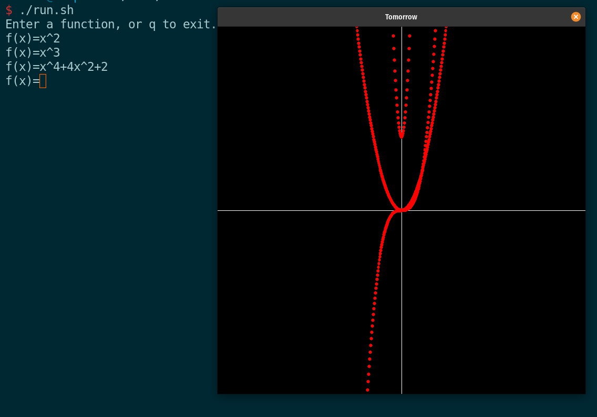

# Tomorrow Graphing Calculator

## Englisch

A small learning project to develop a simple, 2D, cross-platform graphing calculator. You give it some functions, it gives you a plot of that function - that's all that we're going for at the moment.

We're all new devs, and we welcome anyone who's interested in contributing - say hi, ask questions, help out on some issues - we try not to bite.

### Usage instructions
See [USAGE.md](USAGE.md)

## Deutsch
Ein kleines Lernprojekt zur Entwicklung eines einfachen plattformübergreifenden 2D-Grafikrechners. Sie geben ihm einige Funktionen, es gibt Ihnen eine Darstellung dieser Funktion - das ist alles, was wir im Moment anstreben.

Wir sind alle neue Entwickler und begrüßen jeden, der daran interessiert ist, einen Beitrag zu leisten - sagen Sie Hallo, stellen Sie Fragen, helfen Sie bei einigen Problemen - wir versuchen, nicht zu beißen.

### Gebrauchsanweisung
Siehe [USAGE.md](USAGE.md)

## Französisch
Un petit projet d'apprentissage pour développer une simple calculatrice graphique 2D multiplateforme. Vous lui donnez quelques fonctions, cela vous donne un tracé de cette fonction - c'est tout ce que nous cherchons pour le moment.

Nous sommes tous de nouveaux développeurs, et nous accueillons tous ceux qui souhaitent contribuer - dites bonjour, posez des questions, aidez sur certains problèmes - nous essayons de ne pas mordre.

### Instructions d'utilisation
Voir [USAGE.md](USAGE.md)